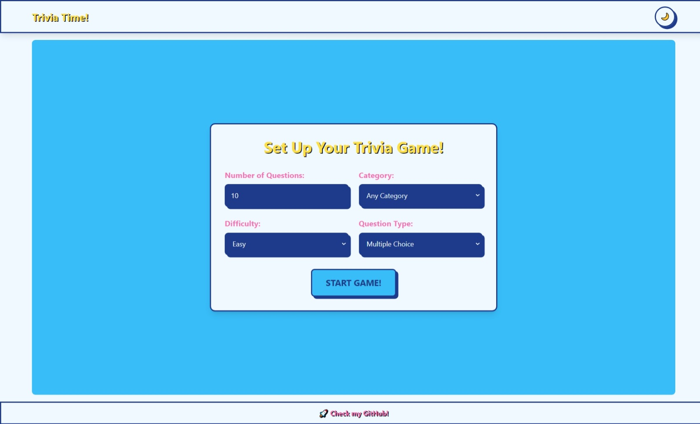

# 🎮 Trivia Time! 🌈

[](https://vercel.com/new/clone?repository-url=https%3A%2F%2Fgithub.com%2FFuwanto%2Ftrivia-time)
[](https://opensource.org/licenses/MIT)

<div align="center">
  
</div>

## 🌐 API Utilizada / API Used

La aplicación utiliza la API de [Open Trivia Database](https://opentdb.com/api_config.php) para obtener preguntas de trivia de diversas categorías y niveles de dificultad.

The application uses the [Open Trivia Database](https://opentdb.com/api_config.php) API to fetch trivia questions from various categories and difficulty levels.

## 🌟 Características Principales / Key Features

### Español

- 🎨 Diseño cartoon con colores vibrantes
- 🌓 Tema claro/oscuro con persistencia
- 🚀 Animaciones y transiciones fluidas
- 📚 Diferentes categorías y tipos de preguntas
- 🏆 Sistema de puntuación con efectos visuales
- 📱 Diseño 100% responsive
- ⚡ Rendimiento optimizado

### English

- 🎨 Cartoon-style design with vibrant colors
- 🌓 Light/dark theme with persistence
- 🚀 Smooth animations and transitions
- 📚 Multiple question categories and types
- 🏆 Scoring system with visual feedback
- 📱 Fully responsive design
- ⚡ Optimized performance

## 🛠 Tecnologías Usadas / Tech Stack

- **Framework**: [Next.js](https://nextjs.org/) 14
- **Estilos**: [Tailwind CSS](https://tailwindcss.com/) + CSS Variables
- **Tipado**: TypeScript
- **Animaciones**: CSS Keyframes
- **Hosting**: Vercel
- **Gestión de Estado**: React Hooks
- **Iconos**: Emojis y SVG personalizados

## 🚀 Instalación Local / Local Installation

```bash
# Clonar repositorio
git clone https://github.com/tu-usuario/trivia-time.git
cd trivia-time

# Instalar dependencias
npm install

# Ejecutar en desarrollo
npm run dev

# Build para producción
npm run build
```
